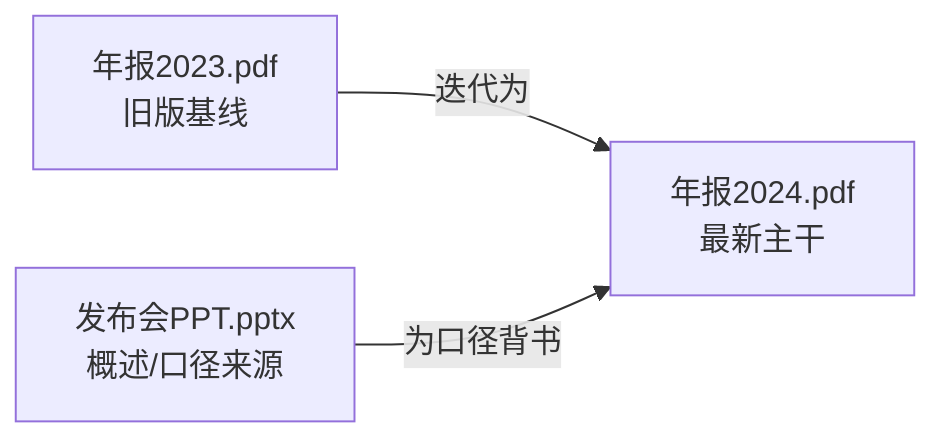

# 阶段二指南：跨文件信息梳理与整合（doc-atlas 核心）

> 读者：执行本 skill 的 AI。输入：阶段一为每个文件产出的 `workspace/<name>/{content.md, assets/, meta.json}`。
> 输出：唯一 IR `model.json`（字段契约见 `references/model-schema.md` 与 `schema/model.schema.json`）。
> 本阶段的成败标准只有一句：**读者看到的是“一份重新组织过的统一知识”，而不是“N 篇文档的摘要拼盘”。**

---

## 0. 心法：重新组织，而非逐文件摘要

逐文件摘要是失败的默认行为。判断你是否掉进这个坑，用三条自检：

1. **大纲是否按主题、而不是按文件名分章？** 如果 outline 顶层出现 “文件A的内容 / 文件B的内容”，立即推倒重来。
2. **同一件事是否只出现一次？** 同一概念/数字/结论如果在面板里出现两遍（来自两个文件），说明没去重。
3. **每个一级 outline 节点的来源是否往往跨文件？** 一个健康的合并结果里，重要节点的 `sources` 经常引用 2 个以上文件。如果几乎每个节点都只指向单一文件，你大概率只是在转录。

记住：**文件是输入单位，主题是输出单位。** model.json 里 `files[]` 保留文件视角（供溯源和侧栏列表），但 `outline` / `chapters` / `keypoints` 一律是主题视角。

### 操作步骤（按顺序执行）

1. **通读**：完整读每个 `content.md` + 对应 `meta.json`（拿到 heading_index / 页码映射 / 字数 / 日期 / 类型）。超长文档见 §7 分批策略。读 `assets/` 里的图片清单，判断哪些是有信息量的图（流程图/图表/示意图），记下它们的相对路径备用。
2. **建概念清单**：边读边在草稿里维护一张“概念→出处”表。每遇到一个事实/结论/数字/定义/术语，记一行：`概念 | 表述 | file_id | page/loc`。这张表是后续去重、冲突、互补判断的唯一依据。
3. **判断文件关系**（§4）：先定全局策略（版本迭代？时间序列？总分？平行互补？），它决定后面所有合并动作的取舍方向。
4. **聚类去重**（§1）：把概念清单里指向“同一件事”的行归并成簇，每簇 = 未来的一个 outline 节点或 keypoint。
5. **标冲突**（§2）：同一簇内表述互相矛盾的，拆出来进 `conflicts[]`。
6. **排层级**（§3）：把簇按“概述↔细节”关系组织成树，落到 outline children 与 chapter 内部 blocks/subsections。
7. **落 model.json**（§5、§6）：建 outline 树 → 每个一级节点配一个 chapter → 选 block 类型 → 提炼 keypoints/diagrams/charts/quotes → 写 file_relations、executive_summary、stats。
8. **溯源回填与自查**（§6、§8）：每个节点补 SourceRef，补不上的标“（待核实）”。

---

## 1. 跨文件去重：判定“同一件事”

### 判定标准（满足任一即视为重复，需合并）

- **同一事实/数据**：描述的是同一对象的同一属性（如“2024 年营收”“系统最大并发数”），即便措辞、单位、精度不同 → 同一簇。
- **同一概念/定义**：解释的是同一术语或同一机制，哪怕详略不同 → 同一簇（详略差异走 §3 互补，不是两个节点）。
- **同一结论/主张**：表达的判断在语义上等价（“应优先做 A” ≈ “A 是首要任务”）→ 同一簇。

### 不要误合并（保持区分）

- 表面词相同但**对象不同**：A 文件的“用户增长”指注册用户，B 文件指付费用户 → 是两件事，不能合并；若两者都重要，做成同一主题下的两个子节点或一张对比图。
- **同名不同义的术语**：跨领域文档里高发，靠上下文区分，宁可拆开也不要错并。
- **粒度差异 ≠ 重复**：总览句和明细句是互补（§3），不是重复。

### 合并动作

把一簇合并成**一个** outline 节点或一个 keypoint：
- 表述取信息量最全、最准确的版本（通常细节文件优于概述文件，新版优于旧版）。
- `sources` 列出**簇内所有出处**，每个 SourceRef 带 file_id + page（或 loc）。例：

```json
"sources": [
  { "file_id": "f1", "page": 3 },
  { "file_id": "f2", "loc": "§2.1" }
]
```

- 合并后再问一次：表述里有没有把两个文件的细节都纳入？如果 B 文件补充了 A 没有的限定条件，合并表述要体现它。

---

## 2. 冲突识别：不静默选一个

### 触发条件

同一簇内，两个及以上文件对**同一事实**给出**不一致**的：数字、日期、范围、结论、命名、状态。差异必须是实质性的（“约 100 万” vs “1,030,000” 不算冲突，是精度；“100 万” vs “300 万”算冲突）。

### 处理：产出 `conflicts[]` 卡片，不要替读者隐藏分歧

```json
{
  "id": "c1",
  "topic": "2024 年活跃用户数",
  "positions": [
    { "value": "120 万", "source": { "file_id": "f1", "page": 5 } },
    { "value": "95 万",  "source": { "file_id": "f2", "loc": "Slide 4" } }
  ],
  "resolution": "采用 f2 的 95 万：f2 日期为 2024-12，晚于 f1 的 2024-06，且 f2 标注了口径（月活去重）。",
  "confidence": "medium"
}
```

- `positions` ≥ 2，每个带不同出处。
- `resolution`：写出**你倾向哪个值 + 为什么**；无法判断就写“证据不足，并列保留，建议人工核实”，并把 `confidence` 设为 `low`。
- 倾向的值同时进入对应 outline 节点 / keypoint 的主表述，但**必须**在该处或章节里挂上这条 conflict（章节内用 `callout`(tone=warn) 或 `table` 把两个值并列展示，并引用此冲突）。

### 权威性 / 时效性判断启发式（从强到弱）

1. **日期更新者优先**：`meta.json` 的 date、文件名里的版本号/日期、正文里的“截至 X”。新版本默认覆盖旧版本（除非旧版是有意保留的基线）。**注意 `meta.json` 的 `date_source`：`"content"`（正文解析）才可信；`"mtime"` 是文件修改时间兜底——下载来的文件 mtime 就是下载日期，不得作为权威性裁决依据。**
2. **一手 > 转述**：原始报告/官方数据 > 二手解读/PPT 摘要。PPT/概述类文件的数字常是约数或过时引用，可信度低于详表/正文。
3. **口径明确者优先**：注明了统计口径、单位、样本、时间窗的值，比裸数字可信。
4. **内部自洽者优先**：与同文件其它数据/小计能对上的值，优于明显算不平的值。
5. **专门 > 顺带**：以该主题为正题的文件，优于顺带提一句的文件。

把你实际用到的那一两条理由写进 `resolution`，别只写结论。判断不了就老实标 `low` 而非硬选。

---

## 3. 互补识别：概述与细节是层级，不是并列

### 判定

A 文件给“是什么/为什么/总体结论”，B 文件给“怎么做/具体数据/分步细节”，且都围绕同一主题 → **互补**。典型信号：一个文件出现在概述/导读类角色，另一个是详表/手册/正文。

### 表达方式（关键：用层级，不用并列章节）

- 概述句 → 上层 outline 节点的 `summary`，或一级 chapter 开头的 `paragraph` block。
- 细节 → 该节点的 `children`（outline 树）+ 该 chapter 内部的 blocks（`subsections` / `table` / `keypoints` / `diagram`）。
- **反例（禁止）**：把 A 做成“第1章 概述”、把 B 做成“第2章 细节”两个平行一级章节。正确做法是：一个一级主题章节，概述在章首，细节在章内逐层展开，`sources` 同时指向 A 和 B。

一句话：**互补 → 合并进同一主题的不同深度；并列章节只留给真正互不隶属的主题。**

---

## 4. 文件关系判断 → 决定合并策略

先给 `files[]` 每个文件标 `role`，再判断全局关系类型，据此选策略：

| 关系类型 | 识别信号 | 合并策略 | file_relations 怎么画 |
|---|---|---|---|
| **同主题不同版本** | 文件名带 v1/v2/日期；标题相同主题；内容大面积重叠 | **以最新版为主干**，旧版仅在“与新版不同处”进 `conflicts[]` 或做新旧对比表；旧版独有且仍有效的内容补入主干 | 旧版 --"被取代/迭代为"--> 新版 |
| **时间序列** | 同指标不同时间点（季报、月报、迭代日志） | 不去重数值，**保留每个时间点**；把同一指标的时间序列做成 Chart.js 折线/柱状图；outline 按主题而非时间分章 | 按时间先后串联 t1 --> t2 --> t3 |
| **总分结构** | 一个总览/索引文件 + 多个分册 | 总览 → 顶层 outline 与 executive_summary 的骨架；分册 → 对应子树的细节 | 总 --"包含"--> 分1/分2/分3 |
| **互相引用** | 文件 A 正文引用 B（“详见…”“数据来自…”） | 被引用方是权威源，引用方的对应论断 `sources` 指向被引用方；冲突时偏向被引用源 | A --"引用"--> B |
| **平行互补** | 同主题不同侧面，无明显主次 | 按主题归并到统一大纲，各文件贡献不同子节点（§3） | A 与 B 共同指向中心主题节点 |

### file_relations.mermaid 写法（仅多文件时给；单文件设为 null）

- 用 `graph LR` 或 `graph TD`，**节点就是文件**（标名字 + 角色/日期），边表达上面的关系动词。
- 节点数 = 文件数，简洁优先；不要把内容主题塞进文件关系图（那是 `diagrams[]` 的事）。
- 示例：



把这段放进 `file_relations.mermaid`，`note` 里写一句人话总结（“以 2024 年报为主干，2023 年报差异见冲突区，PPT 提供口径说明”）。

---

## 5. 落地 model.json：从合并结果到各字段

### 5.1 outline 树（REQUIRED）

- 编号严格 `1` / `1.1` / `1.2.1`，`children` 嵌套表达层级；编号要和 chapter 的 id 对得上。
- 每个节点：`title`（主题，不是文件名）、`summary`（一句话概括，可空）、`importance`、`sources`（合并簇的全部出处）、`children`。
- 顶层节点数建议 4–8 个，是合并后的主题骨架。**一个一级 outline 节点 ↔ 一个 `chapters[]` 条目**（id 相同）。

### 5.2 chapters（REQUIRED）：右侧内容，靠 blocks 编排

每个一级 outline 节点配一个 chapter，`blocks[]` 从调色板按内容选型（见 §5.4）。`sources` 写章节级总出处。

### 5.3 内容该进哪个字段（决策表）

| 内容性质 | 去向 |
|---|---|
| 全篇 4–6 个最关键数字（一眼抓主线） | `highlights[]`（顶层，首屏大号指标卡）；章节内局部关键数字用 `metric` block |
| 全局最重要的结论/数字/定义/风险（5–10 条） | `keypoints[]`（顶层，全局），章节内可用 `keypoints` block 复述局部要点 |
| 因果链 / 流程 / 概念关系 / 组织结构（**核心卖点**） | `diagrams[]`（Mermaid，整行大图）或章节内内联 diagram block |
| 可量化、可比较的数字（趋势、占比、对比） | `charts[]`（Chart.js）或章节内内联 chart block |
| 值得原样保留的有力原句 | `quotes[]`，章节内用 `quote` block 引用 |
| 同一事实多文件不一致 | `conflicts[]`（§2） |
| 文件之间的关系 | `file_relations`（§4）；内容主题关系才进 `diagrams` |
| 一般叙述、背景、解释 | chapter 内 `paragraph` block |

顶层数组（keypoints/diagrams/charts/quotes）放“全局、跨章复用”的，章节内内联放“仅属于该章”的；需要复用时定义在顶层、章节里用 `*_id` 引用。

### 5.4 blocks 选型判据（哪类内容值得画图）

- **paragraph**：默认载体。叙述、背景、推理、过渡。能用一句话说清就别画图。
- **callout**：需要醒目的提示——风险(`danger`/`warn`)、关键前提(`info`)、达成项(`success`)。冲突在章内常用 `warn` callout 引出。
- **keypoints**：3 条以上并列要点，且每条值得单独配重要度与出处时。
- **metric（大号指标卡组）**：把局部关键数字（如"22 万 / 10 年累计节省"）抽成大字号卡片，别只埋在段落里。全篇最关键的 4–6 个数字提到顶层 `highlights` 上首屏。
- **diagram（Mermaid）— 核心卖点，务必做足**：内容里出现**关系或顺序**就画——`flowchart` 流程/因果、`mindmap` 概念分解、`sequenceDiagram` 交互时序。**判据：能画成箭头/层级的才画；只是几条并列事实，用 keypoints 别硬画。** 通读后先找出"这份文档集的核心逻辑"做成一张**主图**（清晰、信息量足、能讲清主线），放进 `diagrams[]`；模板会**整行大尺寸渲染并支持点击放大**，所以节点要命名清楚、箭头带动词标签、层次分明——宁可一张扎实大图，别堆十张零碎小图。
- **chart（Chart.js）**：内容里出现**可比较的数值集合**才转——时间序列→line、分类对比→bar、占比构成→pie/doughnut。**判据：有 ≥3 个可比数值且比较本身有意义才转；单个孤立数字放进文本或 metric。** 同一指标多文件不同值 → 做对比图（并联到 conflict）。**两条图表纪律不能丢**：① **区间数据用区间表达**——如噪音「≥70 / <50」别画成定值 70/50，用区间/堆叠或在标签标「≥ / <」；② **不同口径并列要标清**——如「一次性投资 vs 10 年累计」并列时，标题/坐标轴/caption 必须醒目标注口径，避免误读为同期可比。
- **table**：结构化多维数据、规格清单、新旧/多方对照。`columns` + `rows` 行列对齐。
- **image**：`assets/` 里有信息量的原图（原始流程图、截图、示意图）。`src` 用 workspace 下路径，渲染器会 base64 内嵌；务必配 `caption` 和 `source`。
- **subsections**：把子主题做成卡片式概览（id/title/summary/importance/sources），适合一级章节下罗列若干平级子节点的摘要。

### 5.5 三层阅读模型：meta / highlights / executive_summary

让面板天然分三层（L1 概览 10 秒、L2 要点 1–2 分钟、L3 细节按需），是"高度炼化、一眼看懂"的落点：

- **L1 概览**：`meta.executive_summary`（3–5 句，写**合并后的全局判断**：核心结论 + 最关键数字 + 有无重大冲突 + 文件集整体讲了什么，至少 1 句）+ `highlights[]`（4–6 个核心数字，上首屏大号卡）。这两样决定读者"10 秒看不看得懂"。
- **L2 要点**：`keypoints[]`（high/medium）+ 核心 `diagrams[]` / `charts[]`，默认显示。
- **L3 细节**：`chapters[].blocks`（章节正文、参数表、工况表…），模板里**章节体默认折叠**，点"展开"才看——所以章节正文要写得"折叠时看标题+小结也成立、展开才看细节"。
- `stats`：`file_count` 必填；`total_pages`/`total_words` 从各 `meta.json` 汇总，拿不到填 `null`；`reading_minutes` 可由字数估算（中文约 300–500 字/分），拿不到填 `null`。
- `content_lang` 跟随文档主要语言；`ui_lang` 跟随**用户在阶段零选定的语言**——所有 AI 撰写文案用 `ui_lang`，逐字 `quotes` 保留原文。见 §8 约束。

---

## 6. 溯源铁律

**每个 outline 节点 / 每条 keypoint / 每个重要论断 / 每个数字 / 每张图表都必须可溯源。**

- SourceRef 至少给 `page`（有页码时）或 `loc`（无页码时：`§2.1` / `Slide 4` / `Sheet1!B2`）之一。
- **PDF 的页码直接读 content.md 里的页锚**：正文每页前有一行 `<!-- [doc-atlas] p.N -->`，你引用的内容落在哪个锚后面，`page` 就是 N——这是机器插入的，**不许凭印象写**；`meta.json` 的 `page_map` / `heading_index` 可交叉核对。非 PDF（无页码概念）用 `loc`。
- `file_id` 必须命中某个 `files[].id`（归一化时按确认清单顺序传了 `--file-id f1/f2/...`，两边天然一致；`validate_model.py` 会核查页码不越界）。
- 合并节点要列**全部**出处，不是只留一个。
- **补不上来源的论断**：要么删掉（若非必要），要么在文本末尾显式标“（待核实）”，并尽量给出最接近的 loc。**绝不允许无源的硬性数字或结论。**
- 自查脚本（§8）会抽查页码真实性——写之前确认 meta.json 里确有该页/该 heading。

### 6.1 “待核实” vs “回查原件”——这两类绝不能混（最易翻车点）

| 情形 | 标注 | 动作 |
|---|---|---|
| 原文**确实没写** / 来自 OCR 低置信 / 多源冲突未定 | （待核实） | 诚实保留，不强补 |
| 原文**其实有**，只是 markitdown 把表格数值列打乱/丢列 → content.md 里读不到 | **不能标"待核实"** | **回查原件**：看 `meta.json` 的 `tables` 登记与页码 → 用 Read 工具按 `pages` 读原 PDF / 看 `assets/` 原图，把真值补回去 |

判定线索：`meta.json` 的 `table_extraction` 为 `low`、或某页 `tables` 有登记但 content.md 对应位置是空/错位，几乎可以确定是"我们没抽好"，**必须回查**，不要默默标"待核实"后被读者当成"原文没有"。**"待核实"偏多本身就是一个危险信号**——先怀疑抽取，再怀疑原文。

---

## 7. 超长文档分批策略

- 单文件 > ~100 页或 content.md 过长导致一次读不全时：**先分批读**（按 heading_index 切块或按页区间），每批产出一份“局部概念清单 + 局部小结”，**再汇总**去重合并。
- 风险点：分批最容易漏掉文档后半部分，和把同一概念在不同批次重复成两个节点。汇总时必须用 §1 再做一遍全局去重。
- 多文件时同理：先各自出局部清单，最后做一次跨文件全局合并，不要边读边定稿。

---

## 8. 硬约束（不可违反）

- **不编造**：所有结论、数字、定义只能来自原文。原文没有的因果/推断不要写进 model；确需补充判断时（如冲突 resolution）要标明是“你的判断”而非原文。
- **不确定标“（待核实）”**：拿不准的值、补不上的来源、无法裁决的冲突，统一显式标注，宁缺毋假。
- **语言分离**：界面文案语言（ui_lang）跟随用户；内容语言（content_lang）跟随文档主要语言。两者可不同（如英文文档、中文用户 → content_lang=en, ui_lang=zh）。
- **去重不过度**：宁可漏并、不可错并；不同对象/不同口径的“同名”内容保持区分（§1）。
- **冲突不静默**：见 §2，永远不替读者偷偷选一个值而不留痕。
- 最终 model.json 必须能通过 `schema/model.schema.json` 校验；REQUIRED 字段（meta / files / outline / chapters）齐全；所有 `*_id` 引用（quote_id/diagram_id/chart_id/chapter↔outline id/SourceRef.file_id）都能解析到目标。

---

## 9. 炼化体检：把“是否真的炼化”变成可量化指标

读者（和你自己）最大的疑问是“它到底有没有真把原文炼化，还是只是搬运/漏读”。解决办法：给“炼化”下定义 → 自动出体检指标 → 二次批判补全。

### 9.1 “高度炼化”的定义（四件事，缺一不算）

1. **去重压缩**：同一事实跨文件/跨章只留一处，`sources` 标全部出处。
2. **升维归纳**：从“原文怎么说”升到“结论/因果/对比”（例：把分散的油耗+噪音+排放，归纳成“价值集中在驻车阶段”这一判断）。
3. **关键信息零丢失**：所有数字、标准号、配置参数、前置条件保留并溯源。
4. **重要性分级**：high/medium/low 反映“对读者/决策的重要性”，不是平铺。

### 9.2 完整性批判第二遍（completeness critic，必做）

第一遍写完 model.json 后，**重读 source** 回答一句话：“哪个**重要数字 / 前置条件 / 结论**原文有、model 却没有？” 把找到的补进去，**循环到再读一遍也挑不出新的**为止。这一步直接回应“到底炼化没炼化”——证据就是“再怎么挑也挑不出该收没收的”。多文件/高风险时这步可交给阶段二·五的核查 subagent 做。

### 9.3 填 `distillation_report` 并守阈值（数值字段给全，机器执行）

写完即填顶层 `distillation_report`（字段见 `model-schema.md` §3.1c）。**数值字段必须给全**——`validate_model.py`（渲染前自动跑）据此机器执行下列纪律，展示文案字段面板另用：

- `sections_mapped` **必须 == `sections_total`**（每个源章节至少映射到一个 outline 节点），缺章回去补。〔校验器：违规退出码 1〕
- `todo_count / data_points > 10%` → **先别交付**：极可能是表格数值列没抽好，按 §6.1 回查原件补回，能恢复的不再标“待核实”。〔校验器直接拦〕
- `claims_with_source_count < claims_total` → 有无源声明，补源或删。〔校验器直接拦〕
- `compression_ratio_x` 落在 ~3 到 ~10 才算“既炼又不漏”；接近 1 = 只是搬运，过高（如 >15）= 可能漏。〔校验器告警〕
- `unmapped_source_blocks` 应为空；非空就要给出“为何不收”的理由（如纯版式/重复目录）。
